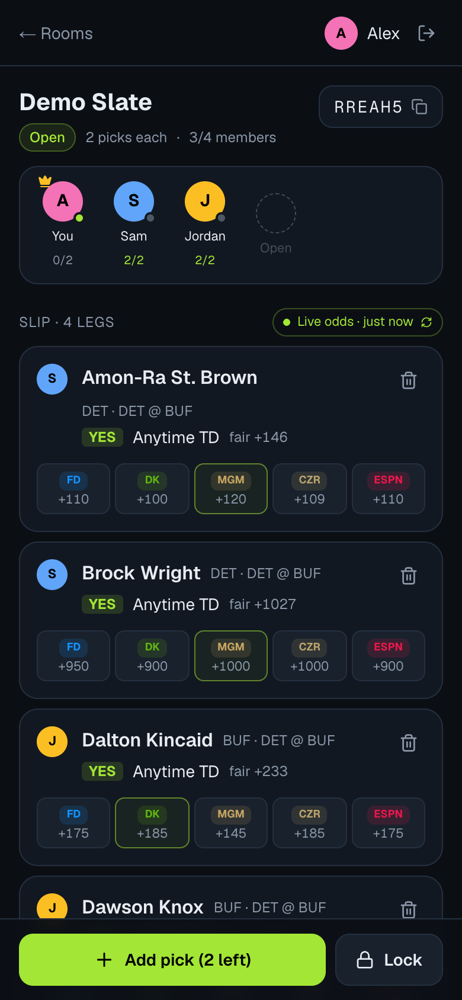
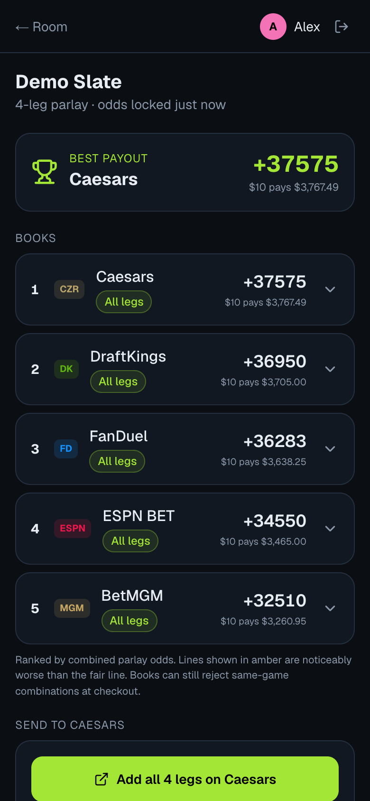

<a id="readme-top"></a>

<!-- PROJECT SHIELDS -->
[![Issues][issues-shield]][issues-url]
[![Last Commit][commit-shield]][commit-url]

<!-- PROJECT LOGO -->
<br />
<div align="center">
  <a href="https://github.com/nicholas-fierro/parlay-party">
    
  </a>

  <h3 align="center">Parlay Party</h3>

  <p align="center">
    Build NFL player prop parlays with friends, then send them to the sportsbook with the best payout.
    <br />
    <a href="#usage"><strong>See how it works »</strong></a>
    <br />
    <br />
    <a href="https://github.com/nicholas-fierro/parlay-party/issues/new?labels=bug">Report Bug</a>
    &middot;
    <a href="https://github.com/nicholas-fierro/parlay-party/issues/new?labels=enhancement">Request Feature</a>
  </p>
</div>

<!-- TABLE OF CONTENTS -->
<details>
  <summary>Table of Contents</summary>
  <ol>
    <li>
      <a href="#about-the-project">About The Project</a>
      <ul>
        <li><a href="#built-with">Built With</a></li>
      </ul>
    </li>
    <li>
      <a href="#getting-started">Getting Started</a>
      <ul>
        <li><a href="#prerequisites">Prerequisites</a></li>
        <li><a href="#installation">Installation</a></li>
      </ul>
    </li>
    <li><a href="#usage">Usage</a></li>
    <li><a href="#project-structure">Project Structure</a></li>
    <li><a href="#roadmap">Roadmap</a></li>
    <li><a href="#contributing">Contributing</a></li>
    <li><a href="#license">License</a></li>
    <li><a href="#contact">Contact</a></li>
    <li><a href="#acknowledgments">Acknowledgments</a></li>
  </ol>
</details>

<!-- ABOUT THE PROJECT -->
## About The Project

<div align="center">
  
  &nbsp;
  
</div>

Group chats are where parlays get built, but lining up everyone's picks and then finding which book actually pays the most is tedious. Parlay Party turns that into a shared room:

* **Everyone adds legs from their own phone.** The host sets picks per person, member limit, allowed prop types, and which games count.
* **Every leg shows every book.** Line and American odds from FanDuel, DraftKings, BetMGM, Caesars, and ESPN BET side by side, compared against a vig-free fair line.
* **The app picks the book.** When the host locks the slip, odds refresh and books that offer every leg are ranked by combined parlay payout. Worse-than-fair lines are flagged.
* **One tap to the bet slip.** Per-leg add-to-betslip links for each book, plus copy/share of the full slip.

House rules are enforced as picks are added: no duplicate legs, no opposite sides of the same prop, one leg per player per stat, and picks from games that already kicked off must be swapped before the slip can lock.

> [!NOTE]
> Parlay Party never takes, holds, or moves money and does not place bets. It is not affiliated with any sportsbook. 21+. Check your local laws. Gambling problem? Call 1-800-GAMBLER.

<p align="right">(<a href="#readme-top">back to top</a>)</p>

### Built With

* [![Next][Next.js]][Next-url]
* [![React][React.js]][React-url]
* [![TypeScript][TypeScript]][TypeScript-url]
* [![Tailwind][Tailwind]][Tailwind-url]
* [SportsGameOdds API](https://sportsgameodds.com) for NFL schedules, player props, fair lines, and betslip deeplinks

<p align="right">(<a href="#readme-top">back to top</a>)</p>

<!-- GETTING STARTED -->
## Getting Started

The app runs fully offline on mock fixtures. Add a SportsGameOdds key to switch to live odds.

### Prerequisites

* Node.js 20 or newer
  ```sh
  node -v
  ```
* (Optional) A free SportsGameOdds API key from [sportsgameodds.com/pricing](https://sportsgameodds.com/pricing). The free Amateur tier covers the five supported books.

### Installation

1. Clone the repo
   ```sh
   git clone https://github.com/nicholas-fierro/parlay-party.git
   cd parlay-party/web
   ```
2. Install NPM packages
   ```sh
   npm install
   ```
3. (Optional) Add your API key to `web/.env.local` (git-ignored; only read on the server)
   ```sh
   SGO_API_KEY=your_key_here
   ```
4. Start the dev server
   ```sh
   npm run dev
   ```
5. Open [http://localhost:3000](http://localhost:3000)

<p align="right">(<a href="#readme-top">back to top</a>)</p>

<!-- USAGE EXAMPLES -->
## Usage

1. **Sign in** with the mock Google chooser or any email from the list and any 6-digit code, then confirm you're of legal age.
2. **Create a room** and set picks per person, max members, prop types, and games. The screen warns when the maximum slip size exceeds a book's leg limit. Or tap **Create demo room with friends** for a room with picks already in it.
3. **Share the 6-character code.** To simulate friends, open a second tab or private window and sign in as someone else; rooms, picks, and presence sync live across tabs.
4. **Add picks.** Search a player, choose a stat, and pick Over/Under (or Yes for Anytime TD) while comparing every book's line and odds.
5. **Lock** (host only). Odds refresh and the prices are frozen for the slip.
6. **Send.** Pick the top-ranked book or any other, then open each leg on that book or copy/share the slip.

### Odds budget

The free SportsGameOdds tier allows 2,500 objects per month, where one object is one game. `/api/slate` keeps usage low:

| Behavior | Detail |
| --- | --- |
| Cache | 30 minutes, in memory and in `web/.sgo-cache/` |
| Lock refresh | Forced refresh, at most once every 2 minutes |
| Budget stop | Fetching stops at 2,400 objects; cached odds are served with a warning |
| No key | Mock slate with the same shape |

Probe what your key returns (uses about one object):

```sh
node scripts/sgo-probe.mjs
```

<p align="right">(<a href="#readme-top">back to top</a>)</p>

## Project Structure

```
parlay-party/
├── images/                 README assets
└── web/                    Next.js app (Vercel)
    ├── scripts/sgo-probe.mjs
    └── src/
        ├── app/
        │   ├── api/slate/  Server route: SGO fetch, cache, budget guard
        │   ├── login/      Mock Google + email code sign-in
        │   ├── rooms/new/  Room settings
        │   └── r/[code]/   Room and send pages
        ├── components/     LegCard, AddPickSheet, UI primitives
        └── lib/
            ├── odds/       SGO normalizer, fetcher, mock slate
            ├── books.ts    Sportsbooks, stat mapping, odds math
            ├── rules.ts    Pick validation, lock rules, ranking, deeplinks
            └── store.ts    Mock realtime backend (localStorage + BroadcastChannel)
```

A `pb/` directory for the PocketBase backend (auth, rooms, realtime) will sit beside `web/`.

<p align="right">(<a href="#readme-top">back to top</a>)</p>

<!-- ROADMAP -->
## Roadmap

- [x] Mobile-first room UI with mock realtime sync
- [x] Live NFL player props from SportsGameOdds with caching and budget guard
- [x] Books ranked by combined payout with fair-line flags
- [x] Per-leg betslip deeplinks and copy/share
- [ ] Verify multi-leg betslip links fill the slip on each book
- [ ] Verify per-book parlay leg limits
- [ ] PocketBase backend: Google + email OTP auth, rooms, realtime
- [ ] Deploy web to Vercel and PocketBase to a VM
- [ ] Grade legs after games and add a leaderboard
- [ ] Pick'em apps (PrizePicks, Underdog, Sleeper) and prediction markets (Kalshi, Polymarket)

See the [open issues](https://github.com/nicholas-fierro/parlay-party/issues) for proposed features and known issues.

<p align="right">(<a href="#readme-top">back to top</a>)</p>

<!-- CONTRIBUTING -->
## Contributing

Suggestions and fixes are welcome.

1. Fork the Project
2. Create your Feature Branch (`git checkout -b feature/AmazingFeature`)
3. Commit your Changes (`git commit -m 'Add some AmazingFeature'`)
4. Push to the Branch (`git push origin feature/AmazingFeature`)
5. Open a Pull Request

<p align="right">(<a href="#readme-top">back to top</a>)</p>

<!-- LICENSE -->
## License

No license has been chosen yet, so all rights are reserved by default.

<p align="right">(<a href="#readme-top">back to top</a>)</p>

<!-- CONTACT -->
## Contact

Nicholas Fierro - [@nicholas-fierro](https://github.com/nicholas-fierro)

Project Link: [https://github.com/nicholas-fierro/parlay-party](https://github.com/nicholas-fierro/parlay-party)

<p align="right">(<a href="#readme-top">back to top</a>)</p>

<!-- ACKNOWLEDGMENTS -->
## Acknowledgments

* [SportsGameOdds](https://sportsgameodds.com)
* [Lucide Icons](https://lucide.dev) (logo is Lucide's Party Popper)
* [Img Shields](https://shields.io)
* [Best-README-Template](https://github.com/othneildrew/Best-README-Template)

<p align="right">(<a href="#readme-top">back to top</a>)</p>

<!-- MARKDOWN LINKS & IMAGES -->
[issues-shield]: https://img.shields.io/github/issues/nicholas-fierro/parlay-party.svg?style=for-the-badge
[issues-url]: https://github.com/nicholas-fierro/parlay-party/issues
[commit-shield]: https://img.shields.io/github/last-commit/nicholas-fierro/parlay-party.svg?style=for-the-badge
[commit-url]: https://github.com/nicholas-fierro/parlay-party/commits
[Next.js]: https://img.shields.io/badge/next.js-000000?style=for-the-badge&logo=nextdotjs&logoColor=white
[Next-url]: https://nextjs.org/
[React.js]: https://img.shields.io/badge/React-20232A?style=for-the-badge&logo=react&logoColor=61DAFB
[React-url]: https://react.dev/
[TypeScript]: https://img.shields.io/badge/TypeScript-3178C6?style=for-the-badge&logo=typescript&logoColor=white
[TypeScript-url]: https://www.typescriptlang.org/
[Tailwind]: https://img.shields.io/badge/Tailwind_CSS-0B1120?style=for-the-badge&logo=tailwindcss&logoColor=38BDF8
[Tailwind-url]: https://tailwindcss.com/
